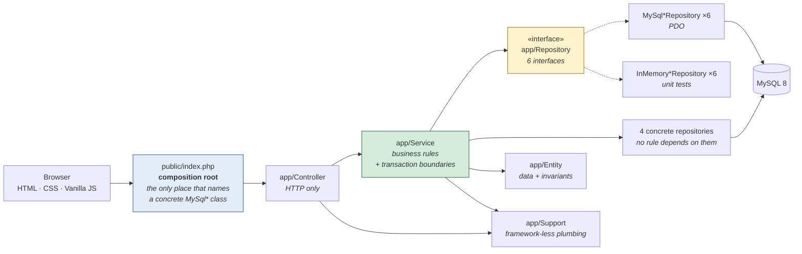
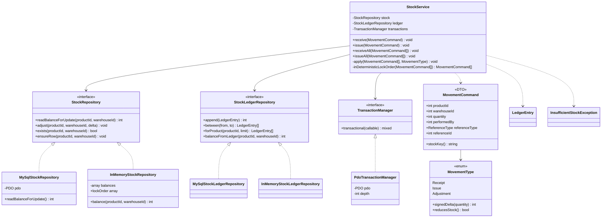
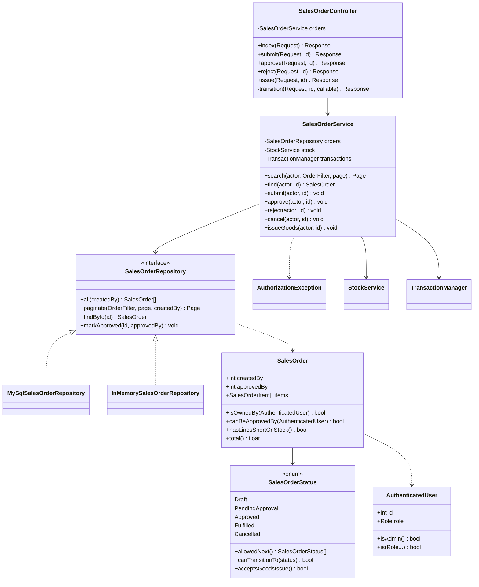
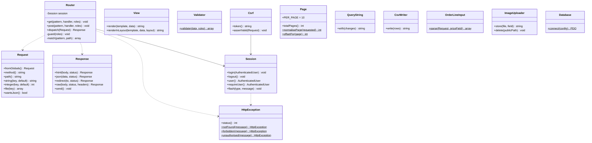

# Class Diagram — AS-BUILT

**Status:** drawn from the finished code, not from intent. Required by DESIGN-01.
**Companion:** [`../planning/class-diagram-initial.md`](../planning/class-diagram-initial.md),
written before any PHP existed. The differences are explained at the end.

**Notation used throughout:**

- `<|..` (dashed, hollow arrow) — **implements an interface**
- `-->` (solid) — depends on a **concrete** class
- `..>` (dotted) — creates or throws, but does not hold as a collaborator

Only the composition root (`public/index.php`) points at concrete `MySql*` classes.
Every service reaches persistence through an interface.

The code contains 85 classes; drawing all of them would be unreadable, so this file shows the
layering plus the three subsystems an assessor is most likely to probe. **Every name here maps
to a real file** — the traceability table at the end lists the path for each.

---

## 1. Layers and dependency direction

Nothing points back up the chain. A Controller may not run SQL; a Service never receives a
`PDO`; a Repository holds no business rule.

---

## 2. Stock — the single writer (ARCH-02)

`StockService` is the only class permitted to write `product_stocks` or `stock_ledger`. Both
order services call it rather than touching stock themselves.

**How ARCH-01 and ARCH-02 are satisfied at once.** ARCH-02 names PDO's
`beginTransaction`/`commit`/`rollBack`, while ARCH-01 forbids business logic from depending on
PDO. `TransactionManager` resolves that: the service declares *that* its work is atomic without
knowing what a transaction is made of. `PdoTransactionManager` is re-entrant — it counts nesting
depth — because an order service opens a transaction and then calls `StockService`, which opens
another, and MySQL has no nested transactions.

---

## 3. Sales order — segregation of duties (SO-01, decision D2)

**Where the rule lives.** `SalesOrder::canBeApprovedBy()` states it once — the actor must be an
Admin **and** must not be the order's creator — and `SalesOrderService::approve()` asserts it.
Nothing in the controller decides it, so the rule holds identically for the HTML form, the JSON
API and a CLI script. Verified over HTTP: an Admin approving an order they raised gets 403; a
second Admin succeeds.

---

## 4. Support layer

`Request` and `Session` exist so no Service ever reads `$_POST` or `$_SESSION`. `Page` holds the
10-per-page rule as a constant; `QueryString` is what keeps filters alive across pagination
links.

---

## What changed between initial and as-built, and why

**Three things changed.** First, the support layer grew five classes that the initial diagram did
not foresee — `Page`, `QueryString`, `CsvWriter`, `OrderLineInput` and `ImageUploader` — because
requirements the initial sketch treated as single features (FIND-01, REPORT-01, PRD-01's upload)
each turned out to contain a reusable piece of plumbing shared by two or three call sites.
Second, `UserRepository` gained an interface: the initial design classified it as master-data
CRUD, but writing `AuthService` showed that authentication carries real rules — an inactive
account may not sign in — that TEST-01 requires to be provable without a database, so ADR-001's
criterion was restated in terms of behaviour rather than table category. Third, suppliers and
customers collapsed from two planned repositories into one `BusinessPartnerRepository` driven by
a `PartnerType` enum, because §1.3 gives them identical fields and identical rules while the
foreign keys still require separate tables.

**One prediction was confirmed rather than changed.** The initial diagram recorded an assumption
that `TransactionManager` would need to be re-entrant once order services wrapped stock calls in
their own transactions. That is exactly what Phase 4 required, and the depth counter in
`PdoTransactionManager` exists for that reason.

**Nothing planned was abandoned.** The layer boundaries, the stock choke point, the injected
transaction boundary and the selective use of repository interfaces all survived contact with
the code.

---

## Traceability — every class in this diagram, and its file

| Class in diagram | File |
|---|---|
| `StockService` | `app/Service/StockService.php` |
| `StockRepository` (interface) | `app/Repository/StockRepository.php` |
| `MySqlStockRepository` | `app/Repository/MySqlStockRepository.php` |
| `InMemoryStockRepository` | `app/Repository/InMemoryStockRepository.php` |
| `StockLedgerRepository` (interface) | `app/Repository/StockLedgerRepository.php` |
| `MySqlStockLedgerRepository` | `app/Repository/MySqlStockLedgerRepository.php` |
| `InMemoryStockLedgerRepository` | `app/Repository/InMemoryStockLedgerRepository.php` |
| `TransactionManager` (interface) | `app/Support/TransactionManager.php` |
| `PdoTransactionManager` | `app/Support/PdoTransactionManager.php` |
| `MovementCommand` | `app/Entity/MovementCommand.php` |
| `MovementType` (enum) | `app/Entity/MovementType.php` |
| `LedgerEntry` | `app/Entity/LedgerEntry.php` |
| `InsufficientStockException` | `app/Service/Exception/InsufficientStockException.php` |
| `SalesOrderController` | `app/Controller/SalesOrderController.php` |
| `SalesOrderService` | `app/Service/SalesOrderService.php` |
| `SalesOrderRepository` (interface) | `app/Repository/SalesOrderRepository.php` |
| `MySqlSalesOrderRepository` | `app/Repository/MySqlSalesOrderRepository.php` |
| `InMemorySalesOrderRepository` | `app/Repository/InMemorySalesOrderRepository.php` |
| `SalesOrder` | `app/Entity/SalesOrder.php` |
| `SalesOrderStatus` (enum) | `app/Entity/SalesOrderStatus.php` |
| `AuthenticatedUser` | `app/Entity/AuthenticatedUser.php` |
| `AuthorizationException` | `app/Service/Exception/AuthorizationException.php` |
| `Router` | `app/Support/Router.php` |
| `Request` | `app/Support/Request.php` |
| `Response` | `app/Support/Response.php` |
| `Session` | `app/Support/Session.php` |
| `View` | `app/Support/View.php` |
| `Validator` | `app/Support/Validator.php` |
| `Csrf` | `app/Support/Csrf.php` |
| `Page` | `app/Support/Page.php` |
| `QueryString` | `app/Support/QueryString.php` |
| `CsvWriter` | `app/Support/CsvWriter.php` |
| `OrderLineInput` | `app/Support/OrderLineInput.php` |
| `ImageUploader` | `app/Support/ImageUploader.php` |
| `Database` | `app/Support/Database.php` |
| `HttpException` | `app/Support/Exception/HttpException.php` |

### Classes not drawn

Omitted for readability, not because they are absent. All follow the same layering:

- **Controllers (8):** `Api`, `Auth`, `BusinessPartner`, `Category`, `Dashboard`, `Product`,
  `PurchaseOrder`, `Report`, `User`, `Warehouse`
- **Services (9):** `Auth`, `BusinessPartner`, `Category`, `Dashboard`, `Product`,
  `PurchaseOrder`, `Report`, `User`, `Warehouse`
- **Repositories:** `ProductRepository` / `PurchaseOrderRepository` / `UserRepository` with
  their `MySql*` and `InMemory*` pairs, plus the four concrete ones
  (`Category`, `BusinessPartner`, `Warehouse`, `Dashboard`)
- **Entities:** `Product`, `PurchaseOrder`, `PurchaseOrderItem`, `PurchaseOrderStatus`,
  `SalesOrderItem`, `BusinessPartner`, `PartnerType`, `Category`, `Warehouse`, `StockLevel`,
  `User`, `Role`, `ReferenceType`
- **Repository criteria:** `ProductFilter`, `OrderFilter`
