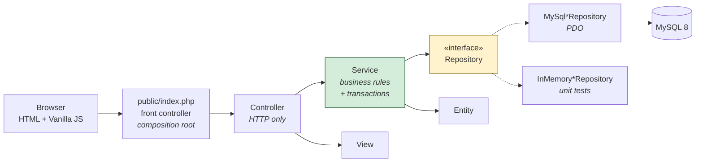
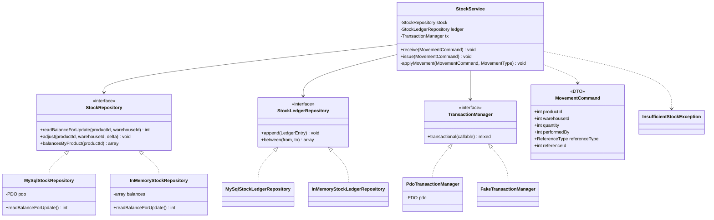
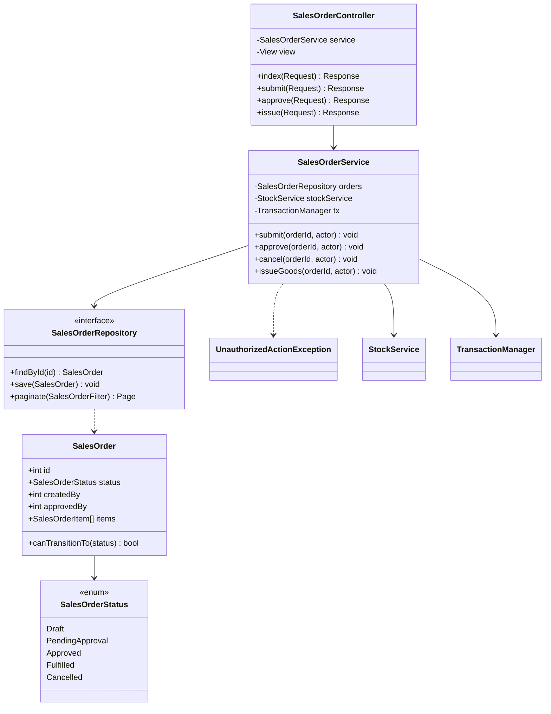
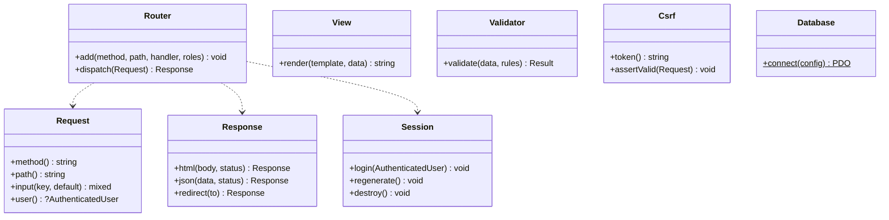

# Class Diagram — INITIAL (pre-implementation)

**Status:** drawn *before* writing application code, as required by DESIGN-01.
**Expected to be wrong in places.** The as-built diagram in `docs/architecture/` will record what
actually happened and why it differed. Do not retro-edit this file — its value is as a record of
intent, and comparing it to reality is itself a graded artefact.

Notation: `<|..` implements an interface · `-->` depends on a concrete class.

## Layer overview

Dependencies point one way: Controller → Service → Repository interface. Nothing points back.
The concrete MySQL repository is depended upon **only** by the composition root.

## Core domain: the stock choke point

`StockService` is the single class permitted to write `product_stocks` or `stock_ledger`.
Order services do not touch stock — they call it.

**Why `TransactionManager` is an interface.** `StockService` must control an atomic boundary but
must not depend on PDO (ARCH-01). Injecting the boundary as a behaviour lets the service say
*"these operations are atomic"* without knowing what a transaction is made of, and lets unit
tests substitute a no-op. Rollback on exception is structural — it cannot be forgotten.

## Sales order flow (segregation of duties)

**Where the approval rule lives.** `SalesOrderService::approve()` throws
`UnauthorizedActionException` when the actor is not an Admin, and again when
`actor.id === order.createdBy`. It is enforced in the **service**, not the controller, so the
rule holds identically for the HTML form, the JSON API and the CLI script — and so it can be
unit-tested with no HTTP involved. The route guard is a coarse first filter, not the rule.

## Support layer (framework-less plumbing)

`Request` and `Session` exist so that no Service ever reads `$_POST` or `$_SESSION` directly —
that is what keeps services unit-testable and satisfies ARCH-01's "no superglobals in business
logic".

## Assumptions recorded at design time

These are guesses. The as-built diagram will confirm or correct each one.

1. One `StockService` will be enough for both receipt and issue; they differ only in sign and
   in whether a sufficiency check applies.
2. Order services will need their own transaction boundary (order status + stock movement must
   commit together), so `TransactionManager` is injected there too — nested transactional calls
   must therefore be handled, most likely by making the manager re-entrant.
3. Pagination/filtering will be common enough across products, POs and SOs to justify one shared
   `Page` / filter abstraction rather than three.
4. Master-data repositories (category, supplier, customer) will get **no** interface, because no
   business rule depends on them and unit tests will not need to fake them.
