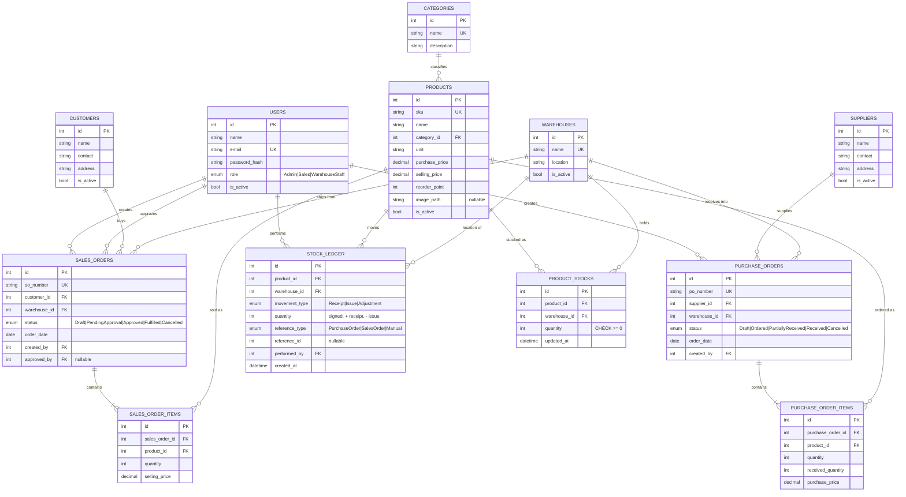

# Entity Relationship Diagram (initial)

Drawn before implementation, from §1.3 of the brief. Reflects `database/schema.sql`.

**StarUML version:** [`erd.mdj`](erd.mdj) holds the same 12 entities as a StarUML ER data model
(12 entities, 90 columns, 17 relationships), for opening in a UML tool rather than reading as
Mermaid. It is **generated** from `database/schema.sql` by
[`scripts/export-staruml.py`](../../scripts/export-staruml.py) — regenerate it after any schema
change rather than editing it, or the two will drift:

```bash
python3 scripts/export-staruml.py
```

> **`schema.sql` stays authoritative.** StarUML's ER model has no vocabulary for CHECK
> constraints, secondary indexes, `ON DELETE`/`ON UPDATE` actions, storage engine or charset, so
> the `.mdj` does not carry them and DDL generated from it would silently omit them. This
> project depends on several: `CHECK (quantity >= 0)` is the last line of defence against
> negative stock, and `UNIQUE (product_id, warehouse_id)` is what makes `SELECT … FOR UPDATE`
> lock exactly one row instead of a range (ARCH-02). Create the database from
> `database/schema-and-seed.sql`; use the `.mdj` to read and present the structure.



## Three decisions this diagram encodes

**1. `PRODUCT_STOCKS` is derived state; `STOCK_LEDGER` is the truth.**
The ledger is append-only history. `product_stocks` is a running balance kept alongside it so
list pages need not aggregate the whole ledger on every request. Both are written in the same
transaction, so `SUM(stock_ledger.quantity)` per (product, warehouse) must always equal
`product_stocks.quantity`. That equality is the system's core invariant and is cheap to assert.

**2. `USERS` relates to `SALES_ORDERS` twice.**
`created_by` and `approved_by` are separate columns precisely so segregation of duties (§1.2) is
recorded in the data, not merely enforced in code. `approved_by = created_by` should never exist
in this database, and that is a query anyone can run to audit it.

**3. Ledger quantity is signed rather than always-positive.**
`movement_type` already names the direction, so the sign is technically redundant — but it makes
reconciliation a single `SUM()` instead of a `CASE` expression. The invariant that is easiest to
check is the one that actually gets checked.
